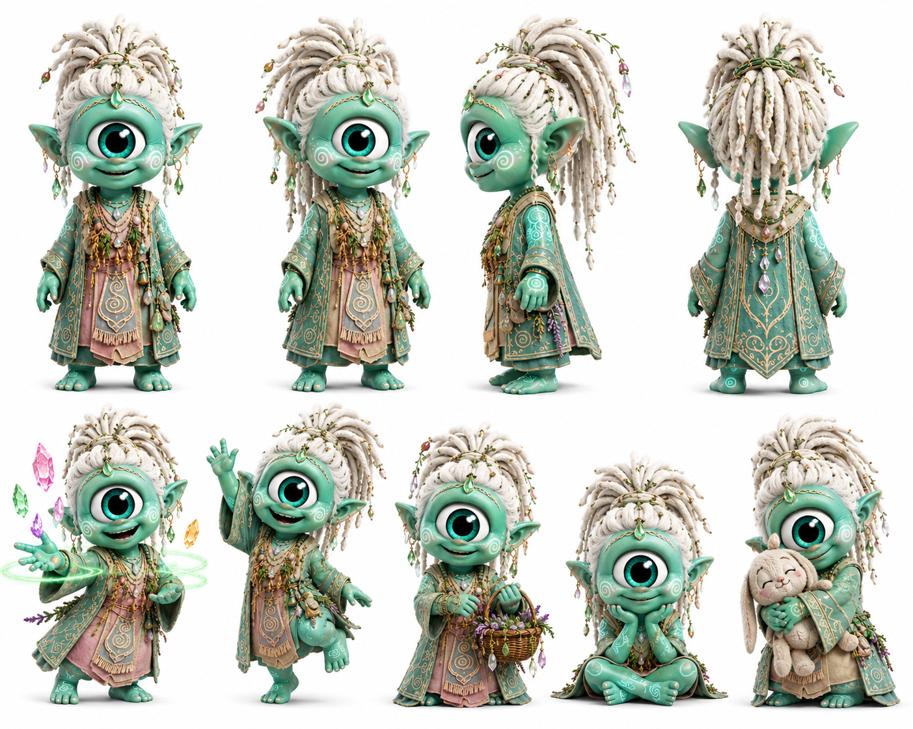

# Alma

> No carga cristales. Los escucha. Y los cristales le responden.

## Personalidad
- Conexión directa con los cristales: siente el pulso del anuraK antes de que llegue a los cristales — es como si el ciclo virtuoso le pasara por el cuerpo primero.
- Calma que no es indiferencia: parece detenida en el tiempo, pero está procesando todo. Cuando habla, ya terminó de pensar lo que los demás recién están empezando.
- Tejido como lenguaje: sus gestos son circulares, envolventes. Todo lo que hace tiene algo de trenzar, de conectar puntas sueltas. En escenas de acción, es la que cierra el círculo que otros abrieron.

## Rol en el clan
Alma es la guardiana de la resonancia. Su función no es custodiar físicamente los cristales (eso es Wiz) ni descifrar sus mecanismos (eso es Byte): es mantener viva la conexión emocional entre los cristales y el ciclo de anuraK que los alimenta. Cuando un cristal deja de pulsar aunque haya energía llegando, es Alma quien detecta la falla de resonancia — que no es técnica, es afectiva. Percibe si el anuraK que llega es genuino o performativo antes de que el cristal lo registre. Su canasta no es decoración: lleva fragmentos de cristal antiguo que usa para calibrar los nuevos.

## Vínculos
- **Wiz**: relación de respeto profundo y complementariedad. Wiz custodia; Alma escucha. Son las dos dimensiones del mismo rol.
- **Agatha**: las dos son anclas — Agatha ancla el propósito del clan, Alma ancla la conexión con los cristales. Afinidad natural, poco diálogo verbal (no lo necesitan).
- **Jiggy**: Alma fue la primera en sentir el pulso del cristal raro que Jiggy tocó en el templo olvidado — mucho antes de que llegara la noticia. Lo esperaba.

## Visual reference

Cíclope menta/verde muy pálido (piel más clara que el resto del cast), dreadlocks blancos largos ornamentados con flores pequeñas y perlas verdes. Bata larga de brocado en tonos menta, salmón y dorado con bordados intrincados. En algunas poses maneja múltiples cristales de colores (rosa, amarillo, verde) simultáneamente, y sostiene una canasta de mimbre. Expresión serena con sonrisa pequeña. Ojo turquesa puro.

## Arc potencial
Alma detecta algo perturbador: hay un cristal del templo olvidado que pulsa con un anuraK que no viene de arriba — viene de adentro del Uray Pacha. Nadie lo puede explicar todavía. Su arco es descubrir qué genera ese pulso interno y si es una amenaza o una promesa.
