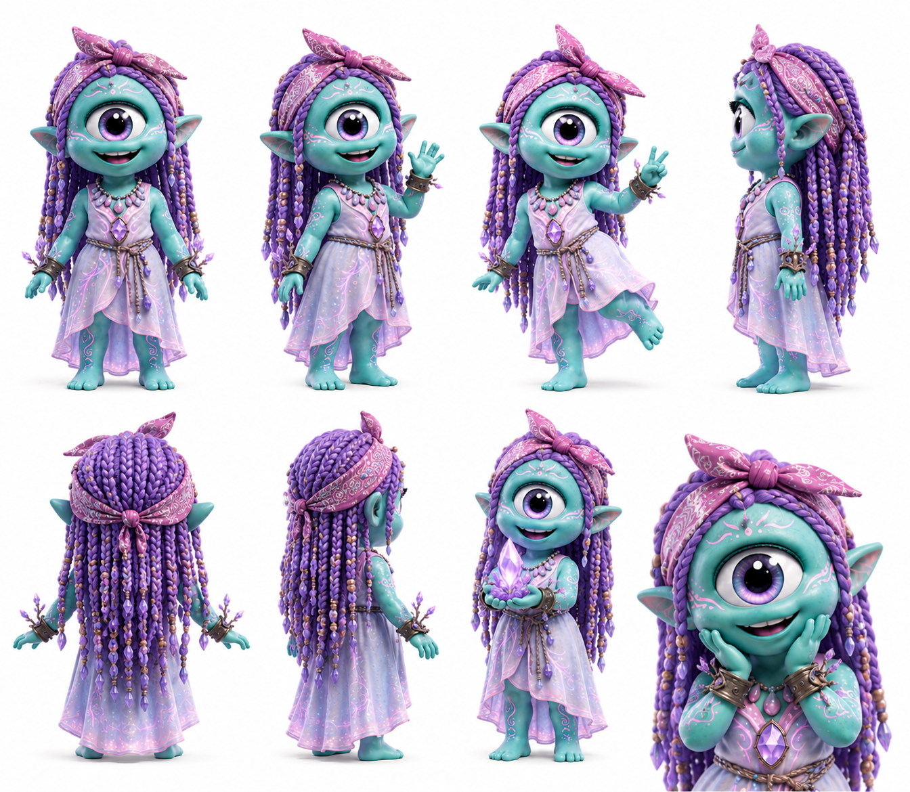

# Aura

> Ve el anuraK como color en el aire. Para ella, una persona lista para dar siempre brilla un segundo antes de actuar.

## Personalidad
- Percepción pre-lingüística: siente la energía de una situación antes de entender su forma. No explica cómo sabe lo que sabe — simplemente lo sabe y luego busca las palabras.
- Delicada en apariencia, firme en juicio: su look suave y su ropa ligera generan expectativa equivocada. Cuando da una opinión, es precisa como bisturí y no la retira por presión social.
- Fascinación por los humanos: de todos los Pax, es quien más disfruta observar a los humanos desde lejos. Encuentra hermoso y misterioso que algo tan pequeño como un gesto humano pueda generar tanto anuraK.

## Rol en el clan
Aura es la perceptora de campo. En misiones a la superficie, su rol es previo al contacto: evalúa el estado de los humanos objetivo antes de que el clan se aproxime. Siente si una persona está abierta a recibir el impulso Pax o si el momento no está listo. Evita misiones fallidas por mal timing — ese es su aporte más valioso y el más difícil de cuantificar. Su cristal violeta no lo carga de golpe: lo va llenando por acumulación de gestos pequeños que otros ni registran.

## Vínculos
- **Luxa**: complicidad exploratoria — Luxa va primero, Aura lee el terreno antes. Se alternan sin acordarlo.
- **Alma**: las dos leen energías pero en canales distintos. Alma escucha los cristales; Aura lee a las personas. Rara vez están en desacuerdo porque operan en planos distintos.
- **Byte**: tensión productiva. Byte confía en patrones medibles; Aura confía en impresiones difíciles de verificar. Han resultado ambos correctos en proporciones similares, lo que genera un respeto incómodo.

## Visual reference

Cíclope teal/azul, cabello en trenzas largas violeta-púrpura con cuentas doradas y lazo/moño rosa en la cima. Vestido largo lavanda con detalles brillantes y tatuajes-joyas azules en el cuerpo. En poses activas, sostiene un cristal violeta curvado que emite luz propia con ambas manos en gesto de ofrenda. Joyas en muñecas y tobillo. Expresión entre soñadora y atenta.

## Arc potencial
Aura ve algo en un humano que ningún otro Pax puede ver: la silueta de lo que esa persona va a hacer en el futuro si el clan interviene en el momento exacto. Pero la visión tiene un costo que ella no ha contado al clan todavía.
