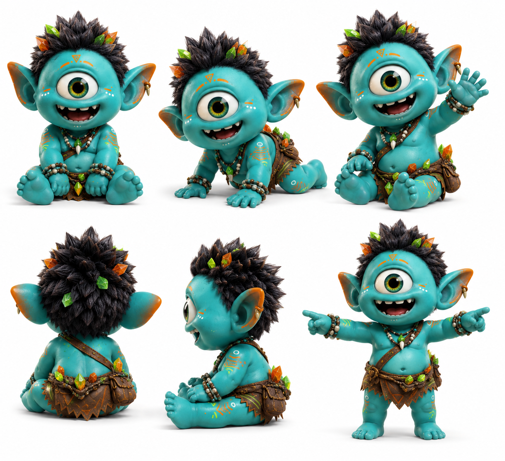

# Baba

> Tiene la sonrisa más grande del clan y no sabe que el solo hecho de existir ya carga cristales.

## Personalidad
- Cría del Uray Pacha: el más joven de todos — todavía en etapa de aprender a caminar con confianza. Su torpeza no es la de KZ (que es genial a pesar de tropezar): es la torpeza genuina de quien todavía está aprendiendo cómo funciona el mundo.
- Energía pura sin filtro: ríe a carcajadas, señala todo con el dedo, se mueve sin inhibición. El anuraK que genera Baba al interactuar con el clan no es de bondad calculada — es de presencia sin disfraz.
- Tatuajes de registro: las marcas amarillas-naranja en su cuerpo no son decoración — son los primeros registros de los cristales que su anuraK ha cargado, trazados en piel por el clan como ceremonia de reconocimiento.

## Rol en el clan
Baba es la cría oficial del clan core — su mascota viva, su recordatorio de por qué la misión importa. No tiene rol operativo en misiones (todavía), pero tiene un rol emocional irremplazable: cuando el clan está agotado o desorientado, Baba aparece con su sonrisa completa y descoloca todo el peso con un gesto sin intención. Es el Ayni más puro del clan — da sin saber que da. Los cristales que pulsan con su anuraK son los más brillantes porque tienen cero performatividad. Wiz dice que Baba es la prueba viviente de que el anuraK no requiere comprensión para fluir.

## Vínculos
- **KZ**: los dos son el corazón tierno del grupo. KZ lo cuida como hermano mayor; Baba lo sigue a todas partes.
- **Fortis**: Fortis es quien carga a Baba literalmente cuando hay que moverse rápido. Baba lo abraza con toda la fuerza de sus brazos cortos.
- **Wiz**: Wiz lo observa con algo que parece ternura controlada. Hay una teoría no confirmada de que Wiz fue quien trajo a Baba al clan, pero nunca lo ha dicho.

## Visual reference

Cíclope teal brillante con proporciones de cría — cabeza enorme respecto al cuerpo, extremidades cortas, panza redonda. Cabello negro en punta con cristales naranjas y hojas verdes entre los pelos. Tatuajes/marcas amarillo-naranja en pecho y brazos. Mini arnés tribal de cuero marrón con cuentas. Sonrisa enorme con diente asomando. En reposo se sienta con las piernas abiertas; cuando está activo señala y camina con paso inseguro pero entusiasta.

## Arc potencial
Baba crece. En algún episodio futuro tiene que tomar su primera decisión sola — pequeña, insignificante para los adultos, enorme para ella. El clan aprende que proteger a Baba no es lo mismo que no dejarla crecer.
