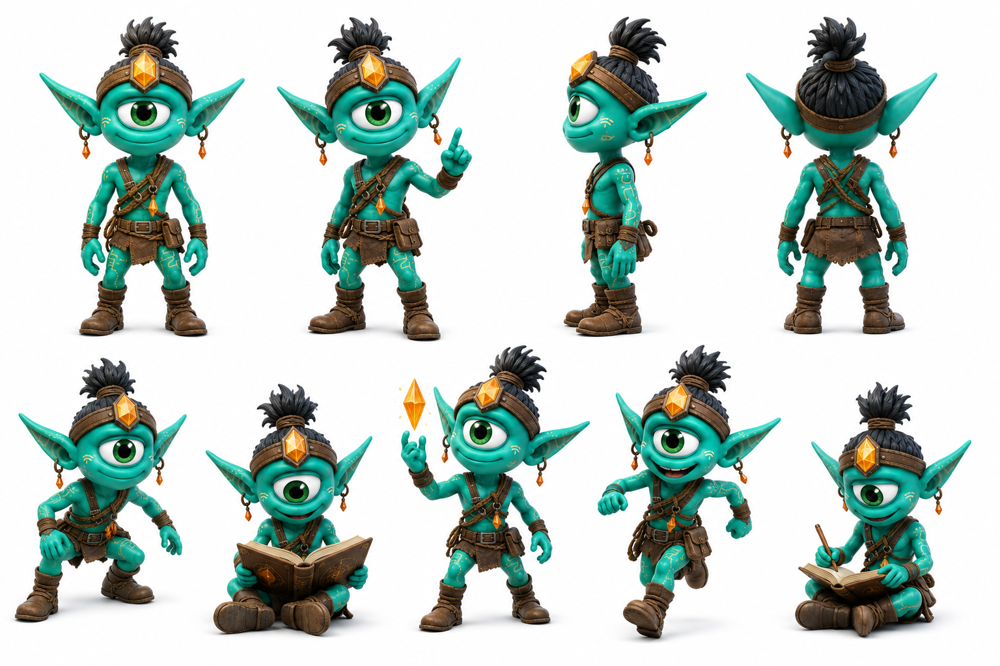

# Brizk

> Va a todos los lugares donde el clan no tiene mapa. Vuelve con el mapa.

## Personalidad
- Energía de descubrimiento constante: siempre está yendo a algún lado o volviendo de algún lado. La curiosidad de Brizk no es la de Jiggy (impulsiva, accidental) — es metódica, intencional, con libreta en mano.
- Orejas de sensor: sus orejas puntiagudas extra-grandes no son casuales — en el lore, la forma de las orejas de un Pax refleja cuánto escucha activamente. Brizk escucha más que nadie.
- Amarillo en el centro: el cristal ámbar en su headband no es decoración — es su herramienta de calibración. Lo usa para verificar si el anuraK de una zona está activo antes de reportarlo al clan.

## Rol en el clan
Brizk es el explorador-investigador — el que hace el trabajo previo que permite que las misiones del clan core tengan información. Mientras Luxa explora de manera intuitiva y narrativa, Brizk documenta sistemáticamente: cuándo estuvo activo el anuraK en una zona, qué humanos dejaron registro de bondad reciente, qué rutas de túnel están operativas. Sus libros no son diarios — son registros de campo con observaciones precisas. La diferencia con Byte es que Brizk trabaja en campo y Byte trabaja en patrones: son complementarios, no duplicados.

## Vínculos
- **Byte**: comparte el rigor analítico pero en capas distintas. Brizk provee los datos de campo; Byte los convierte en patrones. Son el equipo de inteligencia del Uray Pacha.
- **Luxa**: buena relación con tensión creativa — Luxa cuenta lo que encontró con color y humor, Brizk lo escribe en reporte de tres líneas precisas. Cada uno cree que el método del otro desperdicia algo importante.
- **Jiggy**: Brizk lleva registros de todos los accidentes de Jiggy como data de campo legítima. Jiggy encuentra eso simultáneamente halagador y perturbador.

## Visual reference

Cíclope teal verde con orejas puntiagudas extra-largas y prominentes (las más grandes del cast), mohawk negro en moño apretado, headband de cuero con cristal ámbar-dorado al frente y aretes naranjas colgantes. Chaleco/harness de cuero marrón con múltiples bolsillos y compartimentos. Botas de cuero. En mano: libro de campo abierto o dedo levantado en gesto de "acabo de notar algo". Postura de observación activa.

## Arc potencial
Brizk tiene un registro de campo que contradice algo que Wiz asumió como verdad durante generaciones. Sabe que tiene la documentación para probarlo. No sabe si decirlo — y si el momento para decirlo ya llegó o todavía no.
