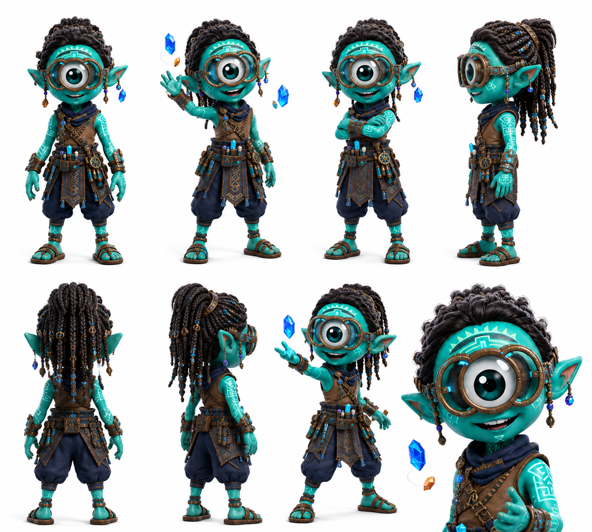

# Cyfer

> El Uray Pacha lleva capas de registro que nadie más puede leer. Cyfer las lee todas.

## Personalidad
- Decodificador nato: donde otros ven roca, Cyfer ve palimpsesto — capas de historia sobreescritas en la piedra, en las vetas de cristal, en los patrones de energía residual. Su goggle/monóculo azul no es estético — es funcional: amplifica frecuencias que el ojo Pax no registra normalmente.
- Curioso sin ansiedad: descifra cosas sin necesitar urgencia. Puede pasarse horas trabajando un solo fragmento sin frustrarse. La paciencia no le cuesta — es su modo natural.
- Social sin ser extrovertido: los cristales azules que flotan a su alrededor cuando trabaja activamente no son peligrosos — son fragmentos de registro que sostiene en suspensión mientras los procesa. El clan aprendió a no distraerlo cuando los cristales están flotando.

## Rol en el clan
Cyfer es el archivista activo del Uray Pacha. Su diferencia con Byte es de dominio: Byte descifra mecanismos y sistemas actuales; Cyfer descifra registros históricos y cristales con memoria. Los cristales raros del templo olvidado tienen capas de anuraK acumulado de crisis anteriores — Cyfer puede leer esas capas como si fueran texto. En la misión del templo olvidado, Cyfer es indispensable: es quien puede verificar qué partes del registro histórico están intactas y cuáles fueron borradas, y por quién.

## Vínculos
- **Byte**: relación de respeto técnico. Byte trabaja en el presente; Cyfer trabaja en el registro histórico. Se consultan mutuamente cuando sus dominios se cruzan.
- **Kif**: alianza natural. Kif tiene las preguntas sobre el pasado; Cyfer tiene la metodología para buscar respuestas en los cristales. Son el dúo de investigación histórica del clan.
- **Wiz**: Wiz conoce a Cyfer desde antes que cualquier otro miembro del clan. Hay historia entre ellos que no se ha contado.

## Visual reference

Cíclope teal con dreadlocks negros largos con cuentas azules colgantes, monóculo/goggle tecnológico sobre el ojo único (marrón-cuero con lente azul). Tatuajes azules en brazos con símbolos de cristal. Harness de cuero con múltiples herramientas colgantes. Pantalón ancho azul marino, sandalias. Cristales azul-zafiro flotando alrededor en poses activas. Postura de trabajo concentrado o mostrando algo con la mano.

## Arc potencial
Cyfer descifra un registro en el templo olvidado que indica que la crisis anterior no fue resuelta completamente — fue pospuesta. Alguien en ese pasado tomó una decisión que compró tiempo pero dejó una deuda pendiente. El clan no lo sabe. Cyfer tampoco sabe si quiere ser quien lo cuente.
