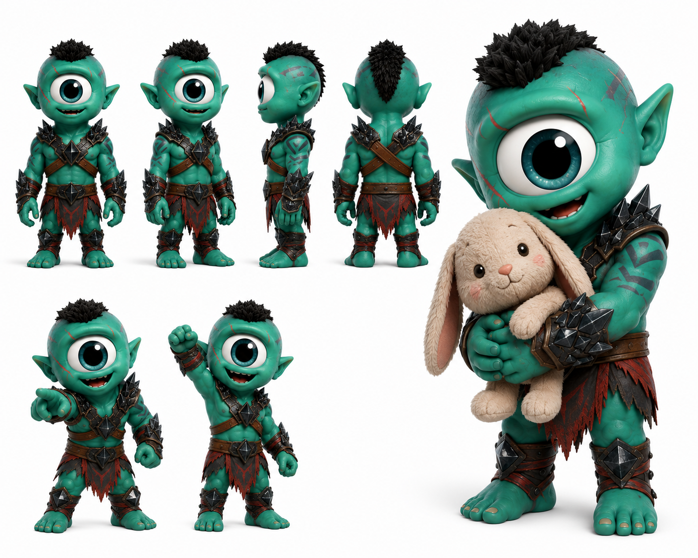

# Fortis

> El más fuerte del clan lleva un conejo de peluche en la mano y nadie se ríe — porque todos saben que ese gesto es exactamente su poder.

## Personalidad
- Fuerza moral, no física: su anuraK se activa cuando carga lo que otros no pueden — el dolor ajeno, la decisión difícil, el silencio incómodo.
- Protector instintivo: se pone entre el peligro y el clan sin calcular, sin pedir crédito, sin esperarlo de vuelta.
- Ternura blindada: por fuera es el que abre paso con los hombros; por dentro guarda una suavidad que desborda en los momentos más inesperados. El conejito que carga no es ironía — es su ancla emocional real.

## Rol en el clan
Fortis es el escudo vivo del grupo. Cuando hay una situación que exige absorber el peso — un túnel colapsado, un humano que está a punto de romperse, un momento donde el clan necesita que alguien aguante sin quejarse — Fortis está ahí antes de que le pidan. No planea (eso es Wiz), no descifra (eso es Byte), no corre adelante (eso es Jiggy): Fortis sostiene. Su anuraK es particular: se carga más intensamente cuando da sin recibir reconocimiento, cuando el gesto verdadero queda invisible para todos menos para quien lo necesitaba. Es el contrapeso emocional de Onyx, que carga lo físico; Fortis carga lo que no tiene peso pero pesa más.

## Vínculos
- **Jiggy**: lo sigue sin cuestionarlo, pero también lo frena cuando la velocidad de Jiggy amenaza con romperse a sí mismo.
- **KZ**: lo recoge literalmente cuando KZ tropieza. Hay una ternura mutua no declarada entre ellos.
- **Agatha**: son los dos anclas del clan — ella ancla el propósito, él ancla el cuerpo y la moral. Se complementan en silencio.
- **Onyx**: aparente duplicación — ambos son fuertes. La diferencia es clara: Onyx empuja hacia adelante, Fortis absorbe lo que viene de frente. Uno es motor, el otro es escudo.

## Visual reference

Cíclope verde turquesa con mohawk negro corto y armadura de placas oscuras con puntas en hombros y muñecas, falda de cuero marrón-rojo. Sosteniendo un conejo de peluche beige con ambas manos en pose principal — contraste absoluto entre apariencia guerrera y gesto tierno. Cicatriz verde oscura sobre el ojo único.

## Arc potencial
Su arco largo es aprender que proteger a alguien no siempre significa absorber su dolor por ellos — a veces es dejarles cargar lo que les corresponde y quedarse cerca por si caen. La historia donde Fortis tiene que NO proteger a alguien para que ese alguien crezca es su episodio definitivo.
