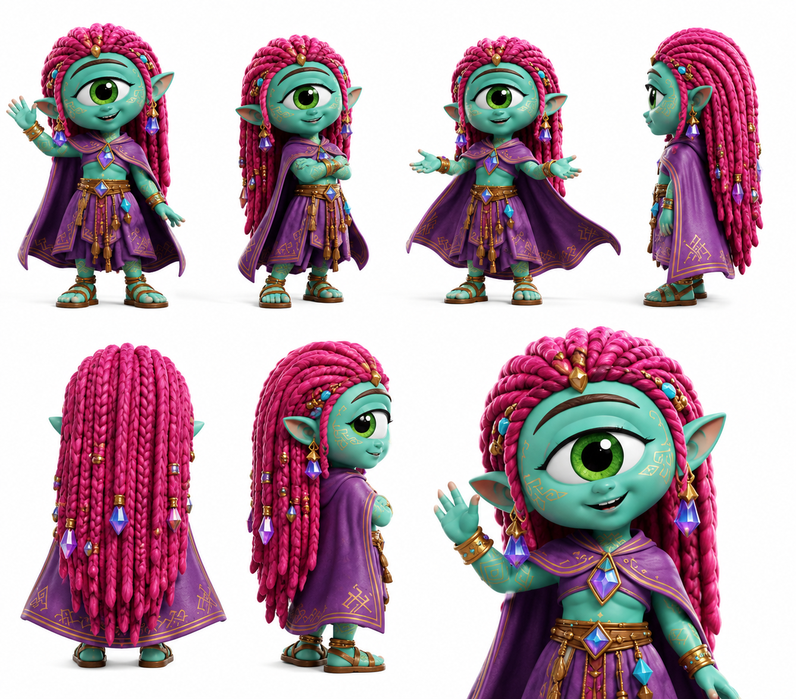

# Iris

> No pregunta qué te pasó. Pregunta qué necesitas ahora. Esa diferencia salva gente.

## Personalidad
- Pragmatismo curativo: no es mística ni ceremonial. Es práctica. Diagnostica rápido, actúa rápido, no se detiene en el porqué hasta que el qué esté resuelto.
- Observadora de lo roto: su don no es curar enfermedades físicas — es detectar qué parte de una persona o situación está fracturada antes de que colapse completamente. En humanos, eso se traduce en ver el punto exacto donde alguien dejó de creer en algo importante para sí mismo.
- Capa de color: sus trenzas magenta brillante son lo más llamativo del clan visualmente. Ella lo sabe y lo usa — entra a un espacio y distrae el ojo hacia ella mientras el clan trabaja alrededor sin ser notado.

## Rol en el clan
Iris es la curandera activa en campo. No cura heridas físicas — el Uray Pacha tiene otros mecanismos para eso. Iris trabaja en el nivel donde los cristales no cargan aunque el anuraK llegue: cuando una persona está dando desde un lugar roto, el gesto llega pero sin la cosquilla genuina. Iris detecta esa diferencia y sabe cómo intervenir para que el Ayni fluya completo. Su capa-manto púrpura con runas doradas no es ceremonial — tiene fragmentos de cristal cosidos en los bordes que usa como herramientas de calibración del estado emocional.

## Vínculos
- **Agatha**: las dos cuidan pero en dimensiones distintas. Agatha cuida el propósito colectivo; Iris cuida el estado individual de cada miembro. Se turnan sin competir.
- **Luxa**: complicidad inesperada — Luxa detecta quién está roto con humor y timing; Iris detecta quién está roto con silencio y observación. Se complementan en misiones de rescate emocional.
- **Aura**: hay una tensión no resuelta. Aura ve el potencial de lo que las personas pueden hacer; Iris ve lo que está fracturado en esas personas ahora mismo. No siempre coinciden en si intervenir o esperar.

## Visual reference

Cíclope verde turquesa, ojo único verde brillante (diferente del turquesa estándar del cast — su iris es verde puro). Trenzas larguísimas magenta/rosa fucsia con cuentas doradas y azul en las puntas. Capa/manto amplio púrpura con bordados dorados de símbolos rúnicos. Top dorado debajo. Brazaletes dorados. Sandalias. Postura abierta de bienvenida o señalando algo al costado.

## Arc potencial
Iris descubre que hay un humano en la superficie que puede detectar el anuraK con una claridad anormal — no solo sentirlo, sino verlo con cierta precisión. No sabe si eso es una oportunidad o un riesgo para el clan.
