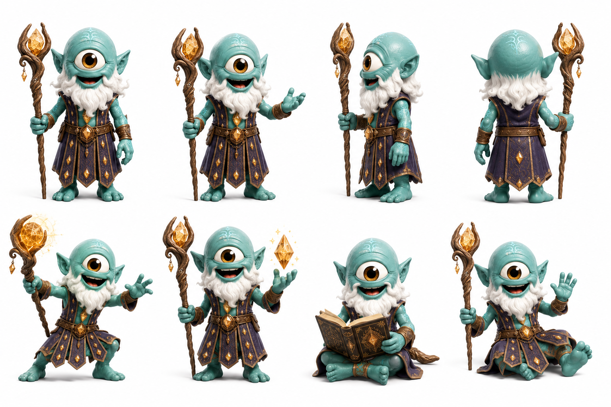

# Kif

> Wiz guarda las respuestas. Kif guarda las preguntas que nadie se animó a hacer todavía.

## Personalidad
- Sabio de umbral: su conocimiento vive en los bordes — entre lo que se sabe y lo que aún no tiene nombre. No acumula respuestas como Wiz; acumula preguntas que destilan verdad.
- Cuestionador suave: no contradice a Wiz en voz alta, pero sus preguntas obligan a que Wiz revise lo que creía saber. La tensión entre ellos no es conflicto — es el sistema de check que mantiene la sabiduría viva.
- Lector de libros que nadie termina: colecciona fragmentos incompletos del templo olvidado, textos a medias, mapas sin final. Cree que lo que quedó sin terminar es más honesto que lo que se cerró demasiado rápido.

## Rol en el clan
Kif es el segundo sabio del Uray Pacha, pero su sabiduría opera en dimensión distinta a la de Wiz. Wiz tiene la sabiduría del custodio — escucha el cristal, lee la energía, decide la redistribución. Kif tiene la sabiduría del umbral — conoce lo que está entre sistemas, los espacios que el lore oficial dejó sin documentar, las versiones del templo olvidado que se perdieron antes de que Wiz llegara. Wiz es el mapa; Kif es el territorio que el mapa aún no dibujó. No compiten: se necesitan. Cuando Wiz dice "no hay registro de esto", Kif suele responder "hay un registro, pero está en forma de pregunta".

## Vínculos
- **Wiz**: compañeros de sabiduría con tensión productiva. Wiz lo respeta profundamente; no siempre le gusta lo que Kif pregunta.
- **Byte**: alianza natural — Kif encuentra los patrones incompletos, Byte los descifra. Son el equipo de investigación del clan cuando aparece algo sin precedente.
- **Jiggy**: Kif fue el primero en tomar en serio el accidente de Jiggy en el templo olvidado, cuando Wiz todavía evaluaba. Hay una confianza mutua temprana.

## Visual reference

Cíclope teal con piel ligeramente más azulada que los demás, completamente calvo (sin cabello), barba blanca larga y esponjosa igual que Wiz. Túnica púrpura oscuro con rombos dorados, bastón con cristal ámbar-dorado en la punta (diferenciador clave respecto al cristal magenta-violeta de Wiz). Libro antiguo en mano secundaria. Postura más abierta y gesticulante que Wiz — Kif explica mientras pregunta.

## Arc potencial
Kif sabe que hay un fragmento del templo olvidado que Wiz nunca llegó a leer — lo tiene él, en forma de mapa incompleto. Cuándo y cómo revelar ese fragmento al clan, y qué costo tiene hacerlo, es su arco de temporada.
