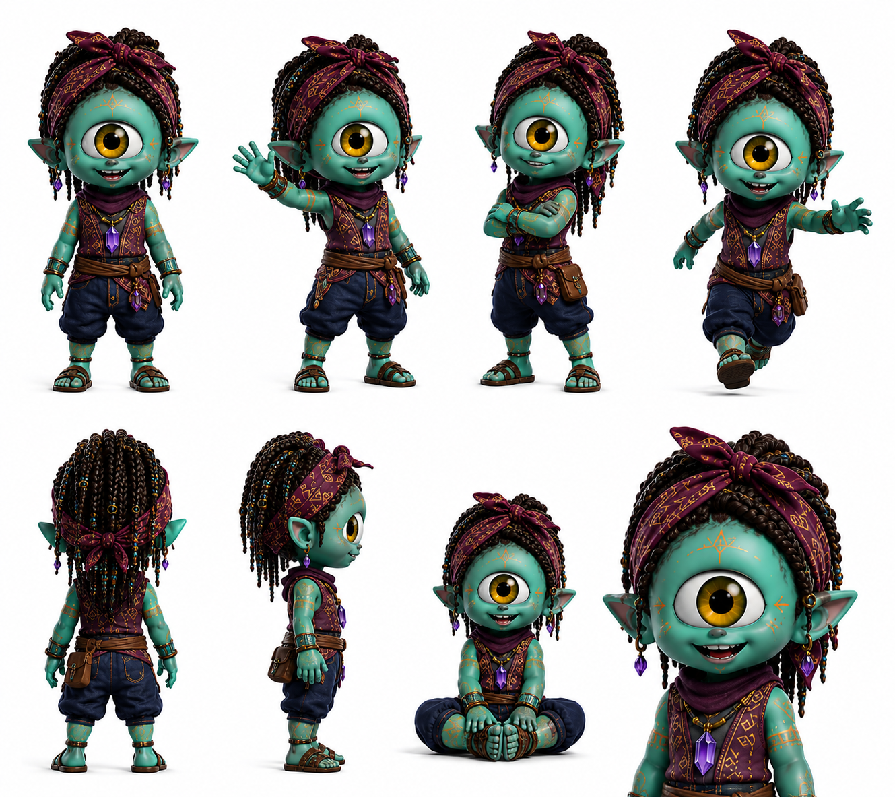

# Ludus

> El clan tiene libros y registros y archivos. Ludus tiene las historias que se cuentan alrededor del cristal encendido. No es lo mismo.

## Personalidad
- Juglar con propósito: en latín, *ludus* es el juego. Ludus toma esa etimología en serio — cree que la mejor forma de que algo important se quede en la memoria colectiva es convertirlo en algo que quieras contar de nuevo.
- Ojo ámbar único: es el único Pax del cast con iris de color ámbar-dorado en lugar del turquesa canónico. En el lore esto no es accidente — el ámbar refleja cristales viejos, memoria acumulada. Ludus tiene algo del viejo en los ojos aunque no sea anciano.
- Generador de anuraK indirecto: cuando cuenta una historia sobre un Ayni pasado, el anuraK de ese Ayni resuena de nuevo en quien escucha. No carga cristales directamente — amplifica los que ya se cargaron convirtiendo los gestos pasados en memoria activa.

## Rol en el clan
Ludus es el narrador oficial del Uray Pacha — no en sentido ceremonial solemne, sino en sentido de alguien que convierte lo que pasó en algo que sobrevive al tiempo. Cada misión exitosa del clan, cada Ayni importante que los cristales registraron, cada momento donde un humano hizo algo genuinamente bueno — Ludus los convierte en relatos que el clan puede contar. Su valor estratégico es que los Pax recuerdan mejor lo que Ludus narró que lo que Byte archivó. La memoria emocional supera al registro técnico. Esto lo sabe Wiz y por eso Wiz y Ludus tienen una relación de respeto particular: Wiz escribe la historia; Ludus la hace vivir.

## Vínculos
- **Wiz**: mutuo respeto. Wiz preserva el conocimiento; Ludus preserva el sentido de ese conocimiento. Wiz dice lo que pasó; Ludus dice por qué importó.
- **Zek**: combinación natural en eventos del clan. Zek pone el ritmo; Ludus pone la historia. Juntos generan las celebraciones post-misión que mantienen la cohesión del grupo.
- **KZ**: Ludus tiene una historia especial sobre KZ guardada para el momento correcto. KZ no lo sabe todavía.

## Visual reference

Cíclope verde turquesa con ojo único de iris ÁMBAR-DORADO (rasgo único, diferenciador visual inmediato del resto del cast que tiene iris turquesa). Dreadlocks oscuros recogidos en turbante colorido rojo-bordeaux con diseños geométricos. Aros de piedra, chaleco con bordados tribales, colgante de cristal violeta en el pecho, pantalón ancho oscuro, sandalias. Tatuajes de patrones en brazos. Sonrisa amplia de contador de historias. Postura relajada o sentado con piernas cruzadas.

## Arc potencial
Ludus descubre que hay una historia que el clan necesita escuchar pero que ningún Pax anterior se animó a contar — porque implica admitir un error colectivo. El episodio donde Ludus elige cómo contar esa historia, o si contarla, define qué tipo de narrador es en realidad.
