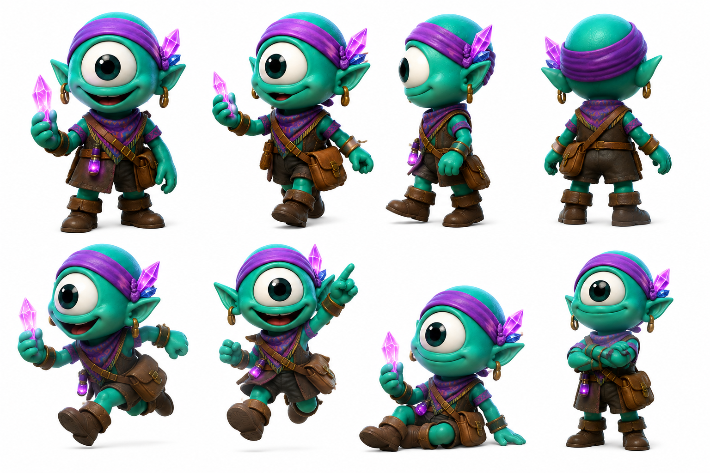

# Luz

> La única que sabe exactamente lo que Jiggy va a hacer antes de que él lo decida — y lo sigue igual.

## Personalidad
- Amiga de infancia absoluta: conoce a Jiggy desde antes de que él supiera quién era. No lo idealiza ni lo disculpa automáticamente — lo conoce, que es distinto.
- Práctica y directa: mientras Jiggy improvisa, Luz ya tiene el bolso empacado y la ruta calculada. No se lo dice con superioridad — se lo dice con cariño y una mirada de "¿listo ahora?"
- Calma que esconde movimiento: parece tranquila pero siempre está en acción. Su cristal violeta no brilla dramáticamente — pulsa constante, como ella.

## Rol en el clan
Luz es la mejor amiga de Jiggy y la estabilidad operativa que él necesita para no estrellarse. No es su sombra ni su secretaria — es su igual con criterio propio. Cuando Jiggy corre sin mirar, Luz mira lo que él pasó por alto. Su rol en misiones es de apoyo en campo: lleva el equipamiento que Jiggy olvidó, conoce los atajos que Jiggy no sabe que existen, y cuando algo sale mal es la primera voz que propone el plan B sin dramatismo.

**Sobre el vínculo afectivo con Jiggy:** hay algo que no es solo amistad y ninguno de los dos lo nombra. Luz lo siente más claramente; Jiggy lo intuye pero lo elude porque nombrarlo cambiaría algo que funciona. No hay triángulo con Mariela — Mariela es humana y pertenece a otra capa del relato. Si Jiggy alguna vez siente algo por Mariela, es fascinación por lo desconocido, no lo mismo que lo que tiene con Luz. Luz representa el hogar; Mariela representa la misión.

## Vínculos
- **Jiggy**: mejor amigo desde siempre, con una capa afectiva sin nombre que ninguno quiere resolver todavía.
- **Luxa**: buena relación, pero Luz es más seria que Luxa. Se admiran sin ser iguales.
- **KZ**: ternura mutua — KZ la considera de las personas más confiables del clan; Luz lo cuida como a un hermano menor torpe.
- **Agatha**: conexión silenciosa. Agatha fue la primera en notar lo que Luz siente por Jiggy y no dijo nada — solo le apretó el hombro una vez.

## Visual reference

Cíclope verde turquesa, cabello cubierto por banda/pañuelo violeta brillante del que sobresalen cristales violeta-magenta en racimo. Aros dorados, chaleco/correa de cuero marrón cruzando el torso con bolso lateral. Pantalón y botas cortas de cuero. Sostiene o señala un cristal violeta con emisión propia. Postura dinámica — en movimiento o lista para moverse.

## Arc potencial
La temporada en que Jiggy finalmente nombra lo que hay entre ellos — o elige no nombrarlo — y Luz tiene que decidir si eso es suficiente o si necesita más, es su episodio central. No es drama romántico: es una historia sobre qué pasa cuando la amistad más importante de tu vida llega a un punto de decisión.
